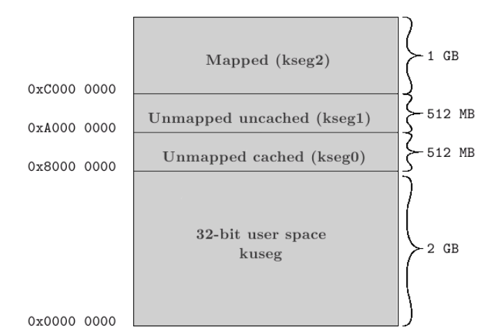
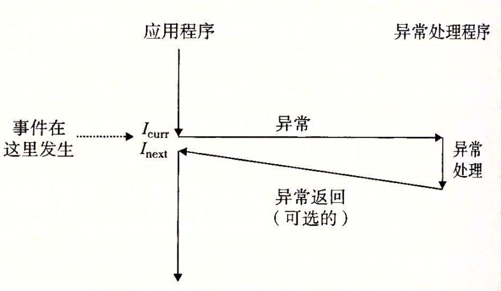
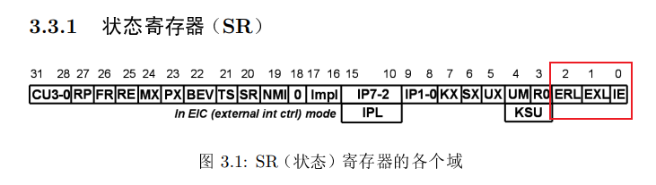
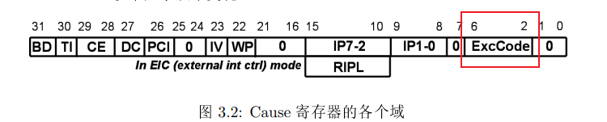
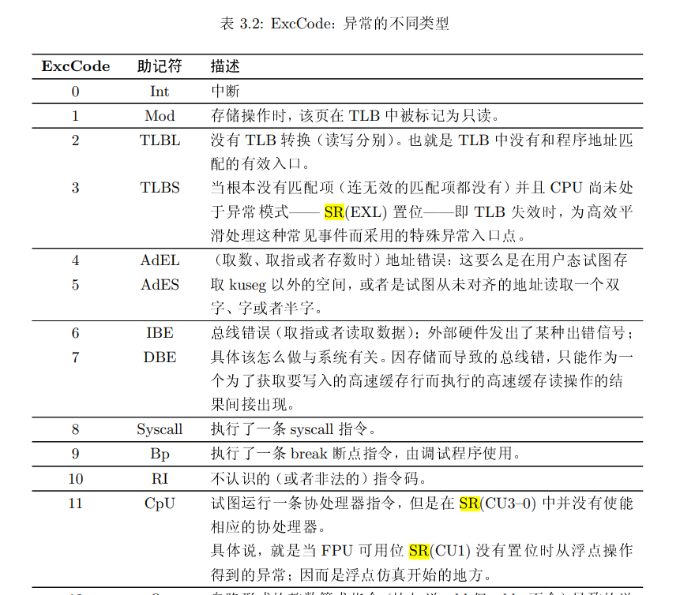
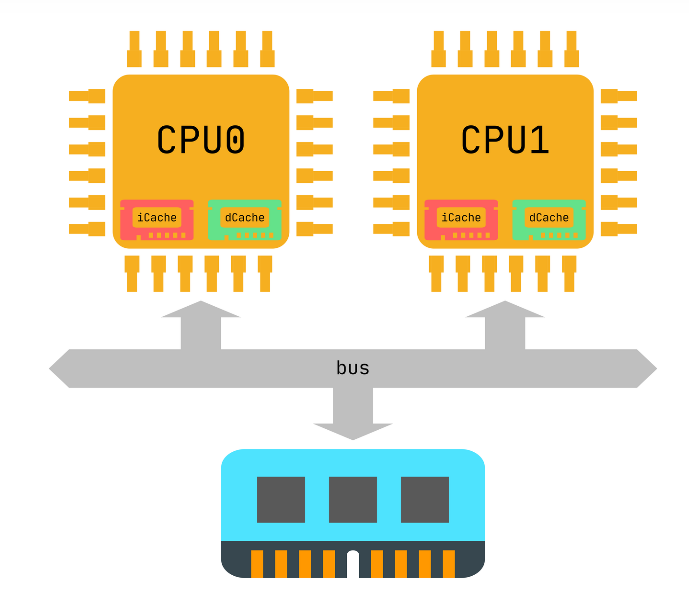
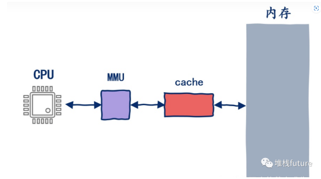
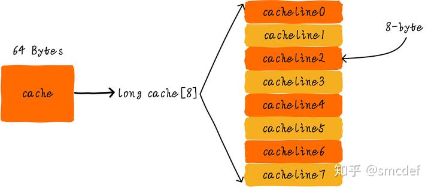
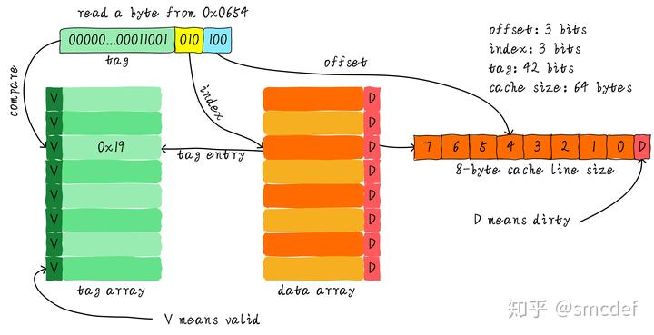

# MIPS架构简述介绍(从软件角度)

[TOC]

## MIPS 架构的地址空间映射

kuseg (0x0 ~ 0x7fffffff)  : 用户态(user mode), 必须要配合 MMU 才能使用, 这部分具体的mapping是由芯片设计厂家自行确定
kseg0 (0x80000000 ~ 0x9fffffff) : **经过cache**的512MB空间, 对应的是物理地址的 0 ~ 512MB 空间,
kseg1 (0xa0000000 ~ 0xbfffffff) : **不经过cache**的512MB空间, 对应的是物理地址的 0 ~ 512MB 空间,
kseg2 (0xc0000000 ~ 0xffffffff) : 核心态(system mode) , 必须要配合MMU使用

而MIPS 启动(BootROM 阶段) 的第一条指令的地址是 0xBFC00000, 也就是物理地址的 0x1fc00000

## 异常/中断 Exception

CPU在 exception 处理流程:

1.   设置EPC 指定之后离开exception 状态后返回地址
2.   设置SR(EXL)位, 强制CPU进入内核状态. 
3.   设置Cause(ExcCode) 寄存器, 用来区分exception的原因
4.   设置PC指针, 跳转到异常入口地址

1.   全局配置中断使能位:  SR(IE) 位 , 置位表示使能所有中断, 清零表示关闭所有中断
2.   异常级别/错误级别:    SR(ERL/EXL) 位,

## 缓存 Cache

### CPU 取值/取指令 的简单流程

### 一致性 cache coherence

从软件角度来说,  保持cache 一致性 (cache coherence) 是很关键的课题. 尤其是多核CPU架构的时候, 以及使用DMA传输的时候

我们假设下面的讲解都是针对64 Bytes大小的cache，并且**cache line**大小是8字节。我们可以类似把这块cache想想成一个数组，数组总共8个元素，每个元素大小是8字节。就像下图这样。

### 同步 flush/invalidate 

flush : 指的是 将 cache 内部的已缓存的数据, 压进去 DDR 内存中
invalidate : 指的是 将cache 已缓存的内容无效化

----

参考资料:

1.   <SEE MIPS RUN>
2.   <深入理解计算机系统 (第4章)>
3.   https://www.modb.pro/db/229137
4.   https://zhuanlan.zhihu.com/p/102293437

