# Hichip GDB使用手册

```txt
下载地址：https://gitlab.hichiptech.com:62443/sw/tools.git
其中：
\tools\GDB\HiChipGDB-H15\HiChipGDB@H1512 为H15xx系列芯片用的gdb，其中A210/A110/B200/B100等都为H15xx系列。
\tools\GDB\HiChipGDB-H16\HiChipGDB-0.1.0为H16xx系列芯片用的gdb，其中A3100/B3100/C3100/D5000等都为H16xx系列。
\tools\GDB\Driver 为对应gdb的驱动文件。
```

## 1、仿真器配置

### 1.1 WIN10安装驱动

```txt
* 如果电脑上没有安装驱动，在设备管理器中显示的是FX3（如图1.1所示）；
* 鼠标左键点击选中，右键选择更新驱动程序，会弹出对话框，之后选择选择浏览我的电脑以查找驱动程序（如图1.2所示）；
* 在WINDOW上面找到存放HichipGDB驱动的位置（如图1.3所示）；
* 点击确定之后，更新驱动成功（如图1.4所示）；
* 在设备管理器中查看已经安装成功的设备，路径：设备管理器-> 通用串行总线控制器->Cypress FX3 USB BulkloopExample Device（如图1.5所示）。
```

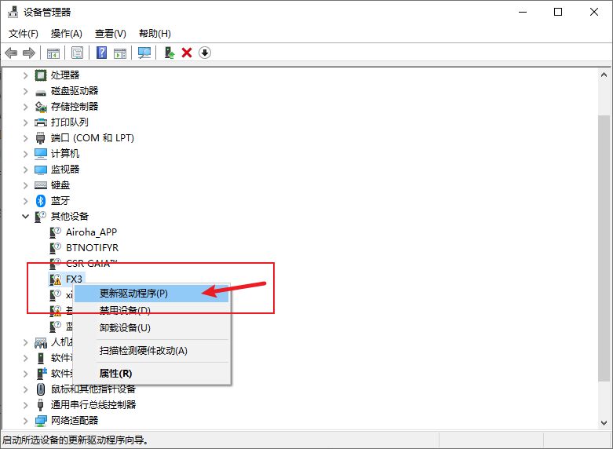

<center>图1.1 WIN10 GBD未安装驱动</center>

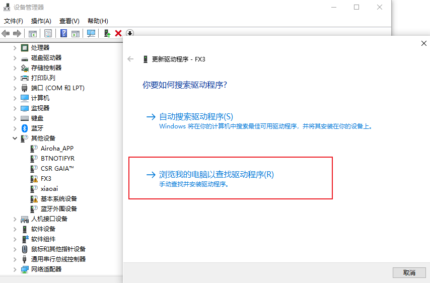

<center>图1.2 WIN10 浏览我的电脑以查找驱动程序</center>

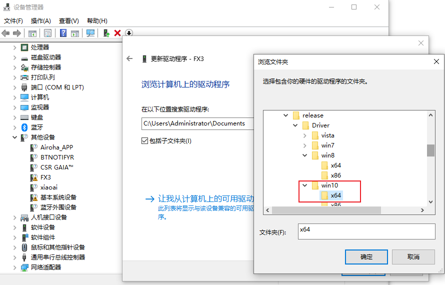

<center>图1.3 WIN10 上选择对应的驱动路径</center>

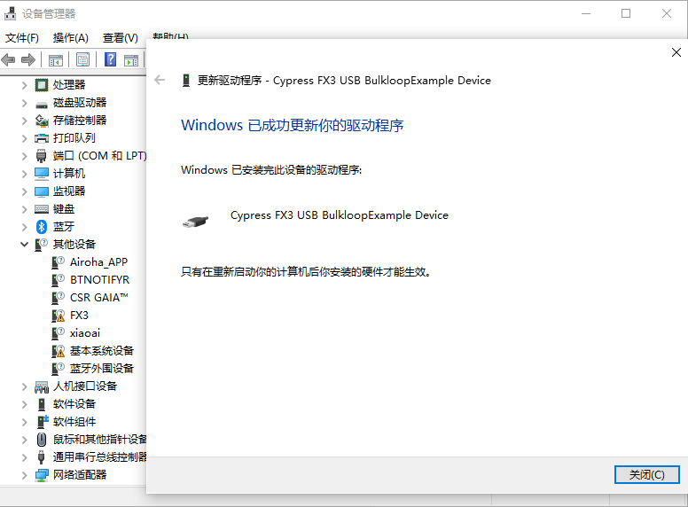

<center>图1.4 WIN10 已成功更新了驱动</center>

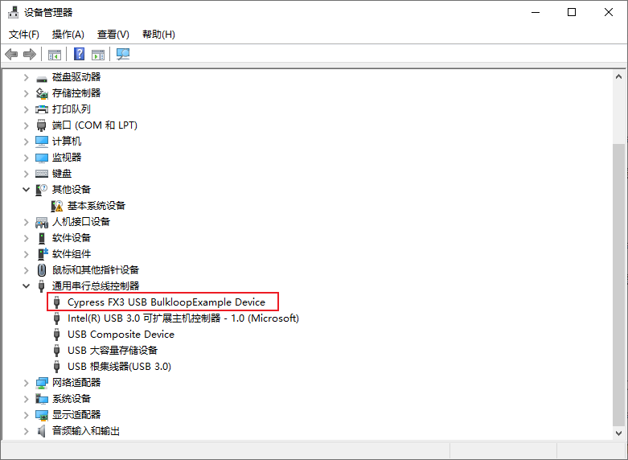

<center>图1.5 设备管理器中查看已经安装成功的设备</center>

### 1.2 打开HiChipGDB.exe，


#### 1.2.1 进行平台的设置 ICE -> Platform Setting


<center>图1.6 WINGDB 平台设置</center>

### 1.3 Platform Setting参数说明

```txt
选项如图1.7 所示，DDR file（DDR内存初始化abs） ，DDR size（DDR内存），CPU Mode选择 Single Core（单核）
notes：H15xx 系列 RunMode选择EEPROM, CPU Mode选择Single Core。
```


<center>图1.7 Platform Setting</center>

```txt
H15xx系列可以根据hcrtos\output\images目录下的aux_code_ddrx_xxxM_xxMHZ.abs来选择。例如本次编译出来的是aux_code_ddr2_64M_1066MHz.abs（如图1.8所示），所以选择的文件是\board\hc15xx\common\ddrinit\gdb\gdb_hc15xx_ddr2_64M_1066MHz.abs（如图1.9所示）。
```


<center>图1.8 hclinux\buildroot\output\images\目录下的内容</center>

```txt
在\hcrtos\board\hc15xx\common\ddrinit\gdb目录下选择gdb_hc15xx_ddr2_64M_1066MHz.abs，如果没有该目录，请解压gdb.rar
```


<center>图1.9 hclinux\buildroot\output\images\目录下的内容</center>


## 2、软件烧录软件到flash

### 2.1、配置说明

按照步骤1.1、1.2、1.3 进行配置之后在进行操作。（如果已经配置过了可以忽略）


<center>图2.1.1 软件配置成功后的界面</center>

### 2.2 使用HichipGBD烧入程序

#### 2.2.1 选择ICE->init ICE


<center>图2.2.1 选择ICE-> init ICE</center>

#### 2.2.2 软件弹出ICE initialize，点击OK

```txt
说明：Plaform选择 H1512，Run Mode选择 EEPROM，初始化成功显示是浅蓝色如图2.2.3所示
```


<center>图2.2.2 ICE -> init ICE</center>

#### 2.2.3 初始化成功。初始化不成功请查看2.3 步骤


<center>图2.2.3 ICE -> init ICE初始化成功显示</center>

#### 2.2.4 初始化成功之后，ICE->DownLoad选择sfburn.ini

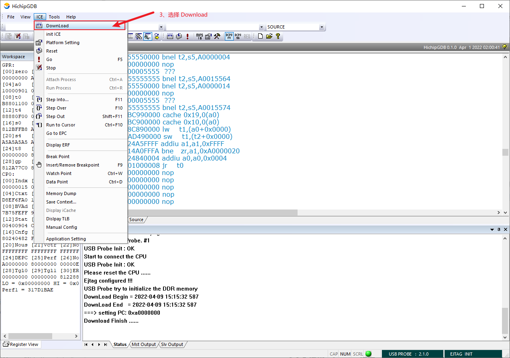

<center>图2.2.4 点击ICE -> Download</center>


#### 2.2.5 选择sfburn.ini 烧入程序


<center>图2.2.5 选择sfburn.ini</center>

#### 2.2.6 程序预写入过程


<center>图2.2.6 程序预写入过程</center>


<center>图2.2.7 程序预写入成功，可按F5 执行烧入到FLASH</center>


#### 2.2.7 烧入成功

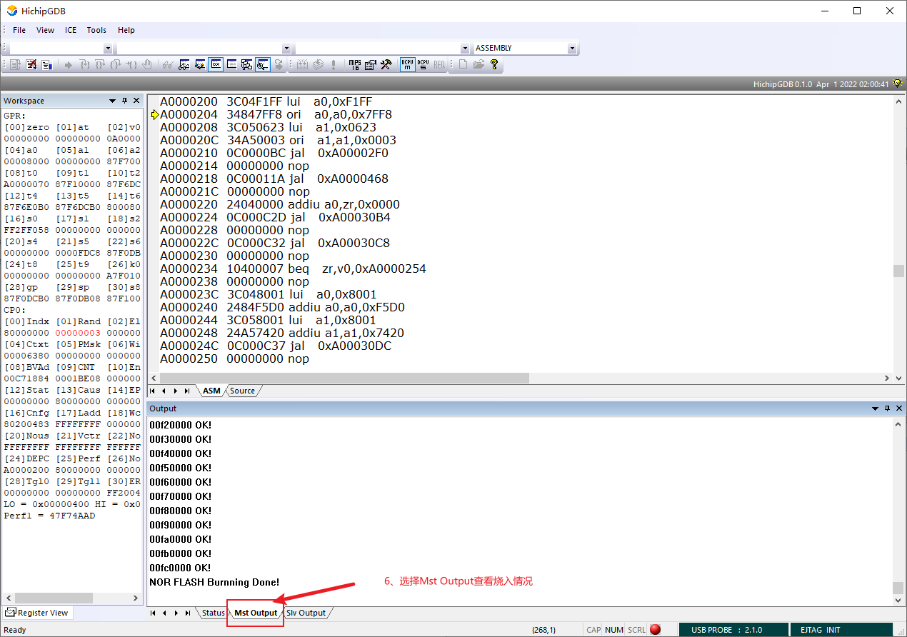

<center>图2.2.8 烧写成功如图所示</center>

#### 2.2.8 烧写成功复位或者重新上电重启串口打印

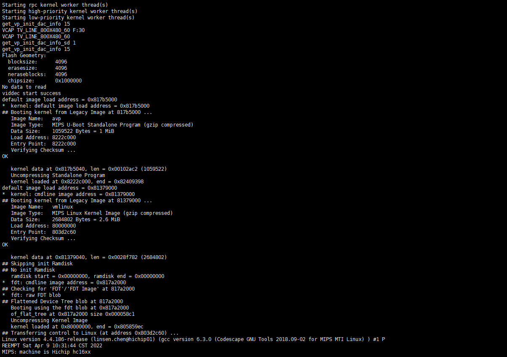

<center>图2.2.9 程序运行</center>

#### 2.2.9 串口输入root 登录

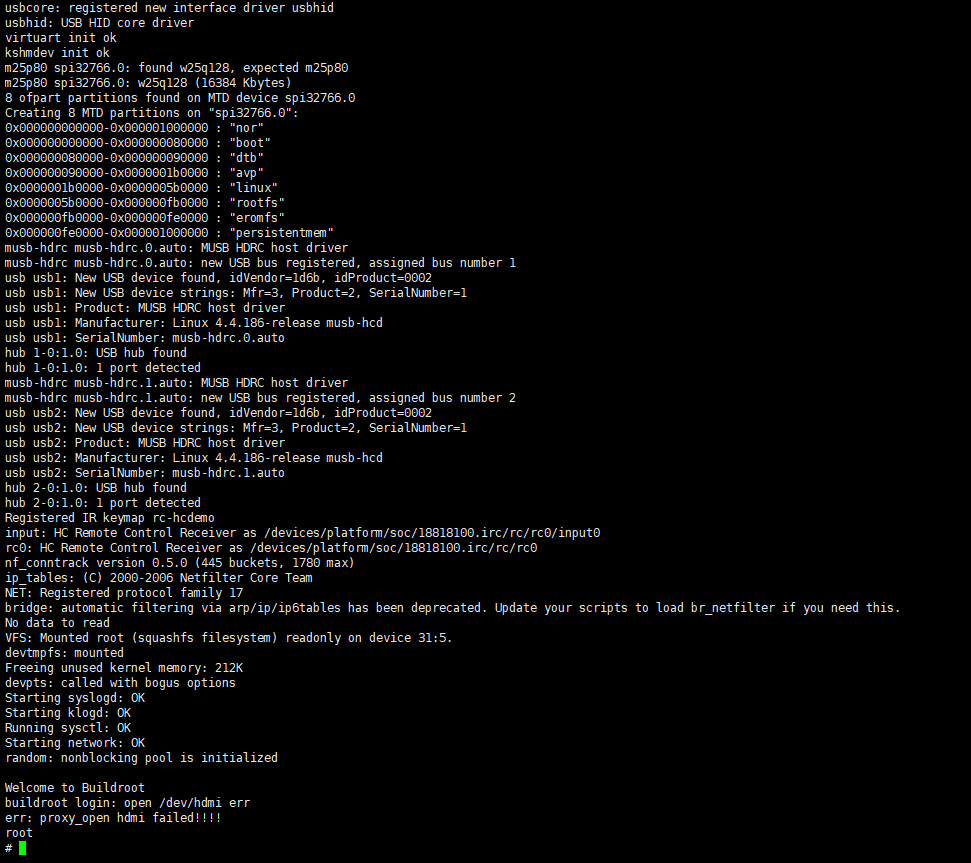

<center>图2.2.10 程序运行 root登录</center>


### 2.3 初始化不成功，弹出 please reset the CPU(如图2.3.1)

```txt
解决方法：

方法1、使用硬件复位键进行复位。

方法2、可先把仿真器断开，重新上电后再插入仿真器接口。

方法3、删除注册表
 3.1 、首先按下键盘“Win+R”打开运行；
 3.2 、接着输入“regedit” ，再点击“确定”打开注册表；
 3.3、搜索 计算机\HKEY_CURRENT_USER\SOFTWARE；
 3.4 、删除已经注册的内容，如图3.3.2所示，然后重新打开HichipGDB软件。
 
方法4、如果已经关闭了HichipGDB软件，但是在任务管理器却还显示了HichipGDB(32位)的任务，鼠标点击右键，进行结束任务，如图2.3.3所示。

方法5、是否硬件上是否使能了仿真功能，如图2.3.4所示。
```

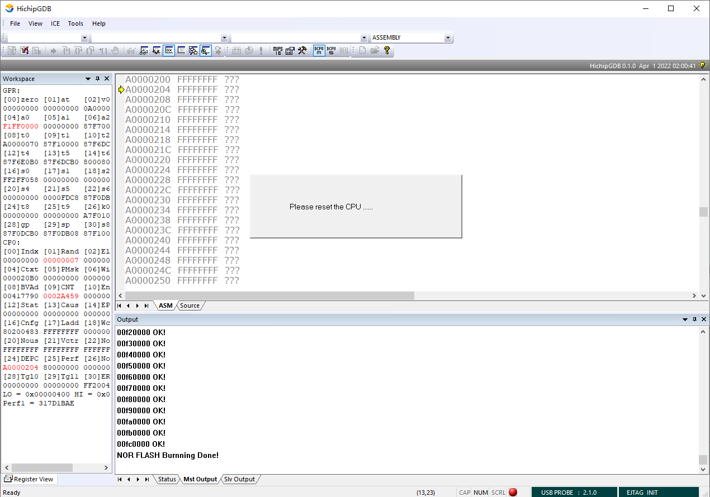

<center>图2.3.1 仿真器弹出please reset the risc</center>

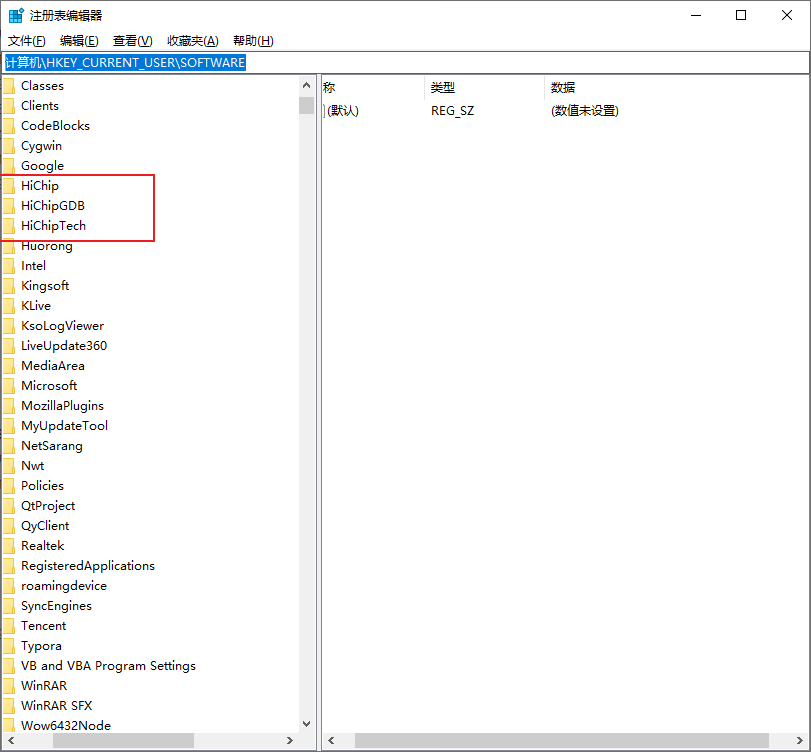

<center>图2.3.2 删除win上注册表的信息</center>


<center>图2.3.3 WIN10上关闭了HichipGDB软件之后，但还是有HichipGDB MFC Application的任务</center>

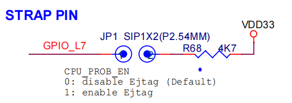

<center>图2.3.4 EJTAG 仿真功能需要使能</center>


